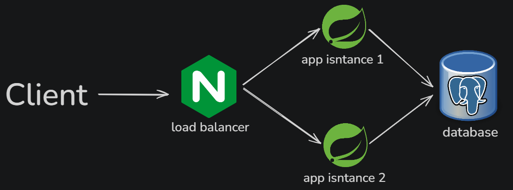

# Simplified Stock Market

A REST API simulating a simplified stock market with wallets, a bank, and an audit log.

## Requirements

- Docker
- Java 21 (for running tests)
- Maven (for running tests)

## Getting Started

Clone the repository:
```bash
git clone https://github.com/Kacper1130/SimplifiedStockMarket
cd SimplifiedStockMarket
```

## Running the Application

The application is started with a single command. Port is passed as a parameter.

**Linux/macOS:**
```bash
./run.sh 8080
```

**Windows:**
```cmd
run.bat 8080
```

This will:
1. Shut down any existing containers
2. Build the Docker image (tests are skipped during build — see Testing section)
3. Start the application on the specified port

The application will be available at `http://localhost:<port>`.

Tests are run separately from the application startup. Docker must be running (required by Testcontainers).

**Linux/macOS:**
```bash
./mvnw test
```

**Windows:**
```cmd
mvnw.cmd test
```

## API Endpoints

### Trade

**POST** `/wallets/{wallet_id}/stocks/{stock_name}`

Buy or sell a single stock.

Request body:
```json
{"type": "buy"}
```
or
```json
{"type": "sell"}
```

- Returns `200` on success
- Returns `404` if the stock does not exist in the bank
- Returns `400` if buying and the bank has no stock available
- Returns `400` if selling and the wallet does not own the stock
- If the wallet does not exist, it is created automatically

---

### Wallets

**GET** `/wallets/{wallet_id}`

Returns the current state of a wallet.

Response:
```json
{
  "id": "wallet1",
  "stocks": [
    {"name": "NVDA", "quantity": 5}
  ]
}
```

- Returns `404` if the wallet does not exist

---

**GET** `/wallets/{wallet_id}/stocks/{stock_name}`

Returns the quantity of a specific stock in a wallet.

Response:
```
5
```

- Returns `404` if the wallet does not exist

---

### Bank

**GET** `/stocks`

Returns the current state of the bank.

Response:
```json
{
  "stocks": [
    {"name": "NVDA", "quantity": 100}
  ]
}
```

---

**POST** `/stocks`

Sets the state of the bank, replacing existing state entirely.

Request body:
```json
{
  "stocks": [
    {"name": "NVDA", "quantity": 100},
    {"name": "AAPL", "quantity": 50}
  ]
}
```

- Returns `200` on success
- Initially the bank is empty — stocks must be added via this endpoint before any trading

---

### Audit Log

**GET** `/log`

Returns all successful wallet operations in order of occurrence. Bank operations are excluded.

Response:
```json
{
  "log": [
    {"type": "buy", "wallet_id": "wallet1", "stock_name": "NVDA"},
    {"type": "sell", "wallet_id": "wallet1", "stock_name": "NVDA"}
  ]
}
```

---

### Chaos

**POST** `/chaos`

Kills the instance that serves this request. The client will not receive an HTTP response — the connection is dropped as the JVM exits immediately via `System.exit(1)`. The application remains available because nginx routes subsequent requests to the remaining instance.

## Architecture



- **2 application instances** run behind an nginx load balancer
- **PostgreSQL** is used as shared state between instances — wallet, bank, and audit log data is persisted in the database
- Killing one instance via `POST /chaos` does not affect availability — nginx routes traffic to the remaining instance
- Two replicas ensure redundancy — if one instance is killed, the other continues serving traffic

## Design Decisions

### High Availability
Two application replicas sit behind nginx. Shared PostgreSQL ensures consistent state across instances. Losing one instance does not lose any data or availability.

### POST /chaos
`System.exit(1)` is called with exit code `1` (non-zero) to signal an abnormal termination, consistent with the chaos engineering intent. `server.shutdown=immediate` is configured to prevent Tomcat from waiting 30 seconds for active requests to drain before the JVM exits — without this, chaos requests take ~30 seconds to complete.

### Wallet Creation
Wallets are created on-demand on the first trade operation. There is no explicit wallet creation endpoint.

### Bank State
The bank starts empty. Stocks must be explicitly added via `POST /stocks` before any trading can occur. `POST /stocks` replaces the entire bank state.

### Audit Log
Only successful wallet operations (buy/sell) are logged. Failed operations and bank operations (`POST /stocks`) are excluded. Log order is guaranteed by a `createdAt` timestamp on each entry.

### Testing Strategy
Two layers of tests are provided:

**Unit tests** (no infrastructure required) test individual service classes in isolation using Mockito. These cover business logic edge cases such as buying when the bank has no stock, selling when the wallet does not own the stock, and correct incrementing/decrementing of quantities.

**Integration tests** use Testcontainers to spin up a real PostgreSQL instance and test the full HTTP stack via MockMvc. These verify correct HTTP status codes, database state after operations, wallet auto-creation, and audit log correctness.

Integration tests are not run during the Docker image build (`-DskipTests`) because the Docker build environment does not have access to the Docker socket required by Testcontainers. Tests are intended to be run locally via `./mvnw test` before or after starting the application.

### Architecture — arm64 and x64
All Docker images used (`postgres:17.9`, `nginx:alpine`, eclipse temurin base image) provide multi-platform builds supporting both `linux/amd64` and `linux/arm64`. No platform-specific configuration is required.
